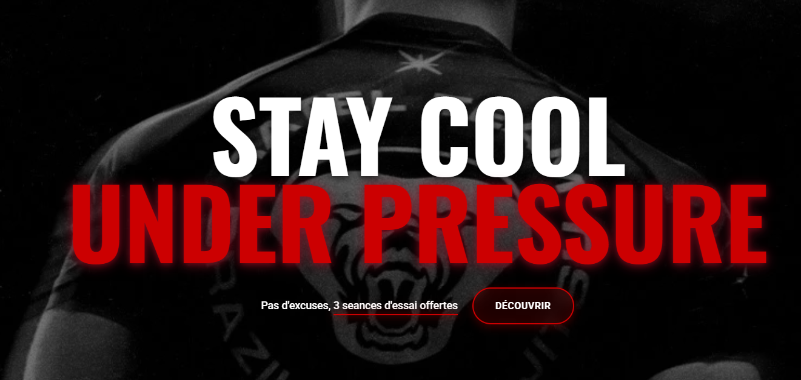

# Ratel Team 🥋

> **Stay cool under pressure.**

Ratel Team est le club de référence de Jiu-Jitsu Brésilien (JJB) à Rennes. Ce dépôt contient le code source d'un site vitrine proposé par **Santos Studio**.



## 📁 Structure du Projet

```text
RATEL/
├── .gitignore
├── index.html              # Page principale
├── README.md               # Documentation
├── pages/
│   └── mentions-legales.html
├── ressources/
│   ├── css/
│   │   └── styles.css      # Styles principaux
│   └── js/
│       └── script.js       # Scripts JavaScript
└── img/                    # Images et assets
    ├── assets/             # Logos et icônes
    ├── avantages/          # Images section avantages
    ├── cours/              # Images des cours
    ├── github/             # Captures pour le README (preview.png)
    ├── hero/               # Image hero
    └── membres/            # Photos des membres
```

## ⚠️ Note Légale / Disclaimer / Crédits

Ce site internet a été conçu et développé bénévolement par **Santos Studio**. 

- **Propriété de la marque** : Le nom "RATEL TEAM", les logos, les images et les textes sont la propriété exclusive du club **RATEL TEAM**. Santos Studio ne revendique aucun droit sur ces éléments d'identité visuelle. 
- **Réalisation** : Ce site a été conçu et développé par Santos Studio à titre de proposition bénévole.
- **Usage du dépôt** : Ce dépôt GitHub est conservé comme projet de portfolio technique.
- **Sources des images** : Les ressources visuelles utilisées sont librement disponibles sur internet.

